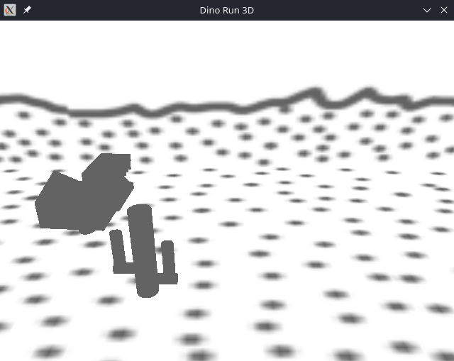
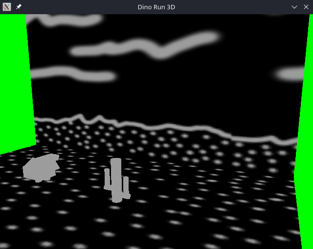

# Dino Run 3D

## Demonstration:

[**Here is our demo for Dino Run 3D**](https://www.youtube.com/watch?v=pm9qnlIBK6g)

## Screenshots

This was a collaboration between myself and [Shoaib Rakhangi](https://github.com/sho-r1024). This was our final project in [Mike Shah's](https://github.com/MikeShah) CS4300 Computer Graphics course during Spring 2024. It is here for archival and portfolio purposes outside of its original Northeastern University GitHub repository.

It can be compiled by running ``build.py`` and will generate an executable in the ``./src/`` directory.
